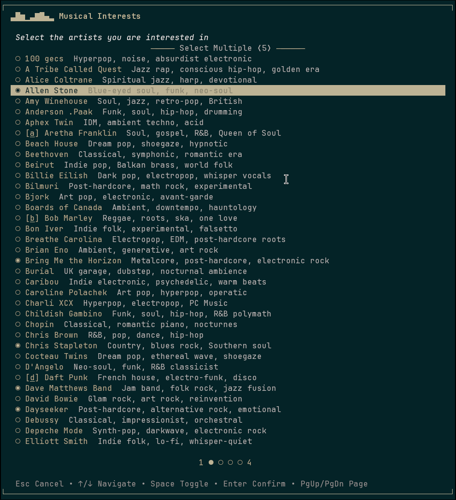

The most Powerful PowerShell Prompt module for interactive, highly customizable prompts

# pwsh-prompt

<div align="center">

Build rich, interactive terminal prompts with type coercion, validation,
hotkeys, pagination, and full alternate-buffer rendering —
all from a single purpose module.



</div>

## Usage

[](https://www.powershellgallery.com/packages/pwsh-prompt)

```powershell
Install-PSResource pwsh-prompt
Import-Module pwsh-prompt -DisableNameChecking
```

> **Why `-DisableNameChecking`?** PowerShell enforces a list of "approved verbs" for
> cmdlet names and emits a warning when a module exports names that don't match. `Prompt`
> is not on that list, so without the flag you'll see a harmless warning on every import.
> The check is purely cosmetic — it has zero effect on functionality, security, or
> compatibility. The approved-verb list is an arbitrary convention, and the warning is
> entirely superficial. This flag simply silences it.
>
> None of the approved verbs accurately describe what these cmdlets do. The closest
> candidates — `Read`, `Request`, `Get` — all carry different semantic expectations.
> `Prompt` is the most precise and intuitive verb for interactive user input, and is worth the harmless warning.
>
> See [Approved Verbs for PowerShell Commands](https://learn.microsoft.com/en-us/powershell/scripting/developer/cmdlet/approved-verbs-for-windows-powershell-commands) for more detail.

_Simple user prompt_
```powershell
$name = Prompt-Input "What's your name?"
```

_Simple user prompt with type validation (user must provide an integer)_
```powershell
$port = Prompt-Input "Port number" -ExpectedType int
```

_Prompt with type validation and extended custom validation_
```
$port = Prompt-Input "Port number" -ExpectedType int -Validation {
    @($_ -ge 1024 -and $_ -le 65535, "Must be between 1024 and 65535")
}
```

_Prompt choice picker_
```
$i = Prompt-Choice @("Red", "Green", "Blue") "Pick a color"
```

_Prompt choice picker with multiple selections enabled_
```
$selected = Prompt-Choice @(
    @{ Value = "dev"; HotKey = "d"; Description = "Development" },
    @{ Value = "staging"; HotKey = "s" },
    @{ Value = "prod"; HotKey = "p"; Description = "Production" }
) "Deploy to:" -Multiple
```

## Commands

### [Prompt-Input](https://github.com/soulshined/pwsh-prompt/wiki/Prompt-Input)

Typed, validated text input with retry logic

- **Intuitive Type Casting** — `string`, `int`, `float`, `bool`, `datetime`, `guid`, `uri`, `regex`, `directory`, `file`, and more
- **Smart bool parsing** — accepts `y/n`, `yes/no`, `on/off`, `1/0`
- **Tab completion** — built-in filesystem completion for `directory` and `file` types
- **Retry control** — infinite retries by default, cap with `-AttemptsAllotment`, or fail-fast with `-ErrorAction Stop`
- **Custom validation** — pass in a scriptblock to validate input (in tandem with the retry logic)
- **Culture-aware parsing** — override with `-Culture` for locale-specific number and date formats

### [Prompt-Choice](https://github.com/soulshined/pwsh-prompt/wiki/Prompt-Choice)

Navigable single or multi-select choice picker

- **Keyboard driven** — arrow keys, digit keys (1-9 page-relative), PgUp/PgDn for pages, Ctrl+Home/Ctrl+End for first/last page, Home/End for first/last on page, Space to toggle, Enter to confirm, Escape to cancel
- **Hotkeys** — bind any letter to a choice for instant selection
- **Pagination** — automatic page splitting based on terminal height
- **Multi-select** — select multiple options
- **Alternate buffer** — fullscreen rendering with complete customization
- **Per-item styling** — individual choices can override foreground, background, and style

### [Styling](https://github.com/soulshined/pwsh-prompt/wiki/about_Label)

Every label parameter accepts a plain string or a hashtable for full styling control:

```powershell
Prompt-Input @{
    Text            = "Enter your name"
    ForegroundColor = @("White", "255;255;255")
    BackgroundColor = @("DarkBlue", "0;0;139")
    Style           = "Bold,Italic"
}
```

- **Dual-target colors** — color tuples provide both 256-color and 24-bit values; the module selects automatically based on terminal capability
- **12 text decorations** — Bold, Dim, Italic, Underline, SlowBlink, RapidBlink, Reverse, Hidden, Strikethrough, DoubleUnderline, Overline (combinable) - support is terminal dependent

## Documentation

Full reference docs are available on the [wiki](https://github.com/soulshined/pwsh-prompt/wiki), or via `Get-Help`:

```powershell
Get-Help Prompt-Input -Full
Get-Help Prompt-Choice -Full
Get-Help about_pwsh-prompt
```
